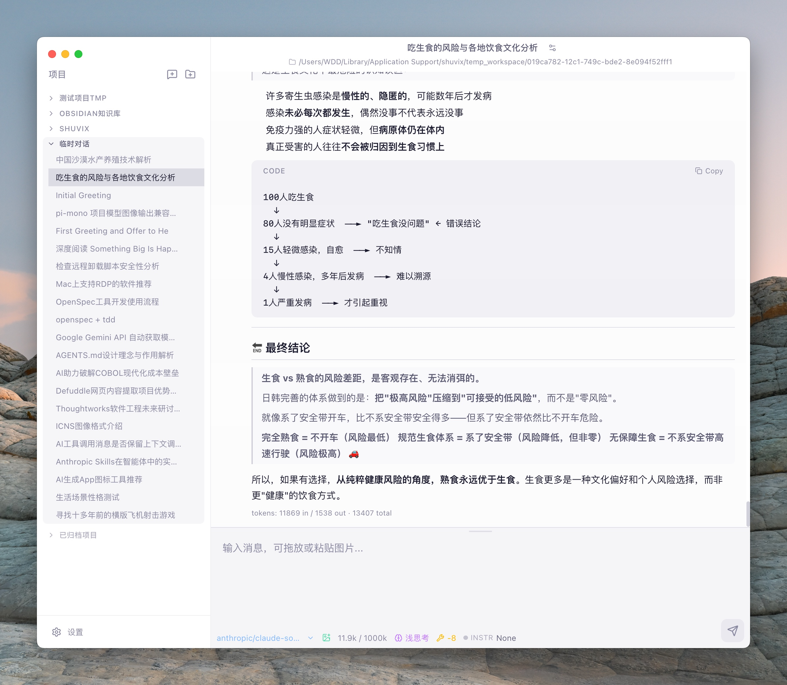

 English | [简体中文](./README.md) | [日本語](./README.ja.md)

<div align="center">

# ShuviX

🤖 Your desktop AI assistant that truly integrates AI into your daily workflow.


[](https://github.com/wangdongdongc/ShuviX/releases)
[](./LICENSE)
[](#-build)
[](https://www.electronjs.org/)

<p>
  <a href="https://github.com/wangdongdongc/ShuviX/releases/latest">
    
  </a>
  <a href="https://github.com/wangdongdongc/ShuviX">
    
  </a>
  <a href="./docs/">
    
  </a>
  <a href="https://github.com/wangdongdongc/ShuviX/releases">
    
  </a>
  <a href="https://github.com/wangdongdongc/ShuviX/issues">
    
  </a>
</p>

</div>

**ShuviX** is a desktop AI assistant. Connect to mainstream LLMs and operate local files and terminal directly through an agentic toolchain — making AI your true partner.

## ✨ Features

- 🔄 **Multi-model switching** — Connect to mainstream LLMs and switch between them freely
- 🛠️ **Agentic toolchain** — Built-in tools for file I/O, terminal execution, code search, and more
- 📁 **Project sandbox** — Restrict AI access to project directories only; shell commands require user approval before execution
- 🐳 **Docker isolation** — Optionally isolate command execution in Docker containers to protect the host environment
- 💾 **Local-first** — All data stored in local SQLite, your privacy is fully protected

## 🖼️ Preview

> A clean conversational interface with Markdown rendering, syntax highlighting, and tool call visualization — every interaction is clear and controllable.

<div align="center">

</div>

## 🚀 Quick Start

```bash
# Install dependencies
npm install

# Start dev server
npm run dev
```

## 📦 Build

```bash
npm run build:mac    # macOS
npm run build:win    # Windows
npm run build:linux  # Linux
```

## 📄 License

This project is open source under the **MIT** license.
