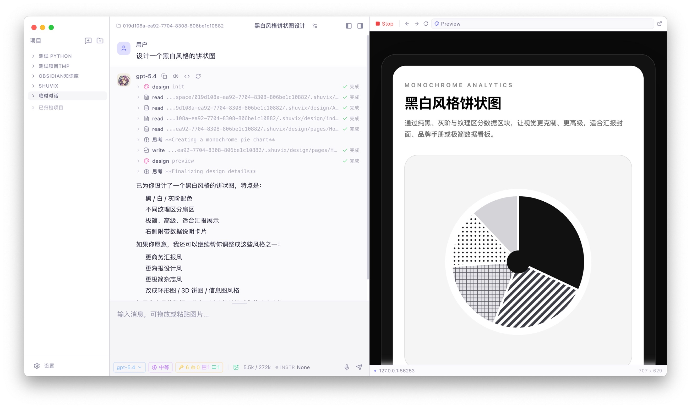

 简体中文 | [English](./README.en.md) | [日本語](./README.ja.md)

<div align="center">

# ShuviX

🤖 桌面 AI 助手，让 AI 融入日常工作。


[](https://github.com/wangdongdongc/ShuviX/releases)
[](./LICENSE)
[](#-构建)
[](https://www.electronjs.org/)

<p>
  <a href="https://github.com/wangdongdongc/ShuviX/releases/latest">
    
  </a>
  <a href="https://github.com/wangdongdongc/ShuviX">
    
  </a>
  <a href="./docs/">
    
  </a>
  <a href="https://github.com/wangdongdongc/ShuviX/releases">
    
  </a>
  <a href="https://github.com/wangdongdongc/ShuviX/issues">
    
  </a>
</p>

</div>

**ShuviX** 是一款桌面端 AI 应用。支持连接主流大模型，通过智能体工具链直接操作本地文件和终端，协助完成各类桌面日常工作。

## ✨ 特性

- 🔄 **多模型自由切换** — 支持接入主流大语言模型，随时切换
- 🛠️ **智能体工具链** - 可随意编排
  - *读写工具*
    - **read** - 读取常见文件、网页内容
    - **write, edit** - 文本文件编辑
    - **ls, grep, glob** - ripgrep 文件搜索
  - *终端工具 (内置审批机制)*
    - **bash** - 本地命令执行，支持 Docker 隔离
    - **ssh** - 远程命令支持，内置凭证管理器
  - *脚本*
    - **python** - 开箱即用的运行时，无需额外安装（Office文档处理、数据分析）
  - *数据库*
    - **sql** - 开箱即用的 Posgres 数据库，可导入 CSV 作为数据源（SQL 数据分析）
  - *UI 设计*
    - **design** - 开箱即用的交互设计和预览工具
- 📁 **项目沙箱** — 基于项目控制 AI 可访问的文件夹
- 💾 **本地优先** — 所有本地数据存储
- 🤖 **扩展性** — 支持 MCP、支持 Skills
- ✈️ **远程访问**
  - *会话绑定*
    - **局域网共享** - 支持局域网内的其他人可以直接通过浏览器访问你共享出来的会话
    - **Telegram Bot** - 支持绑定 Telegram Bot 进行对话

## 🖼️ 界面预览

> 提供简洁的对话界面，集成 Markdown 渲染、代码高亮与工具调用可视化，让每一次交互都清晰可控。

<div align="center">

</div>

## 🚀 快速开始

```bash
# 安装依赖
npm install

# 启动开发服务器
npm run dev
```

## 📦 构建

```bash
npm run build:mac    # macOS
npm run build:win    # Windows
npm run build:linux  # Linux
```

## 📄 License

本项目基于 **MIT** 许可证开源。
